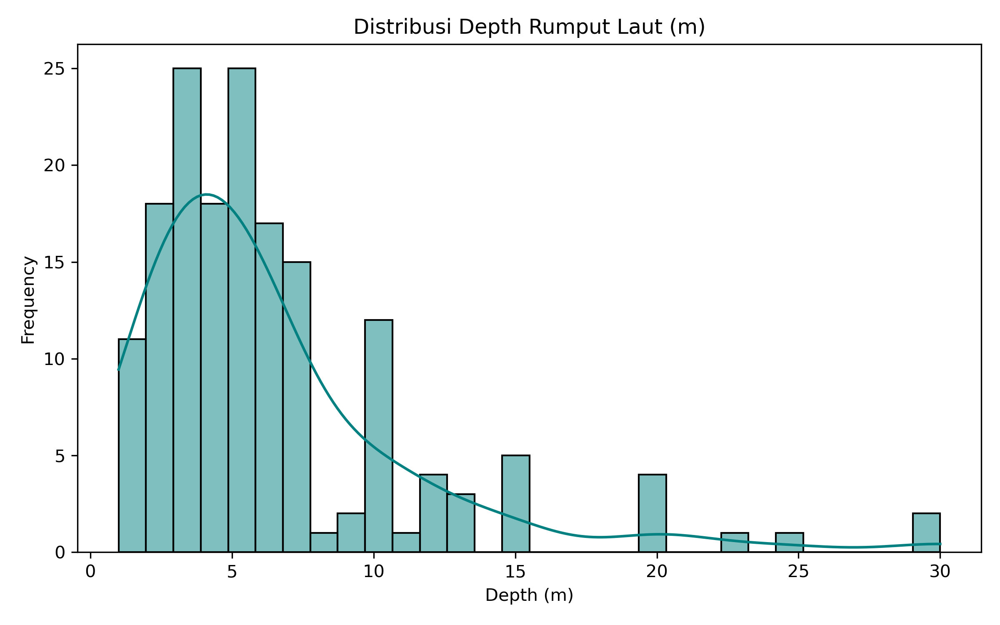
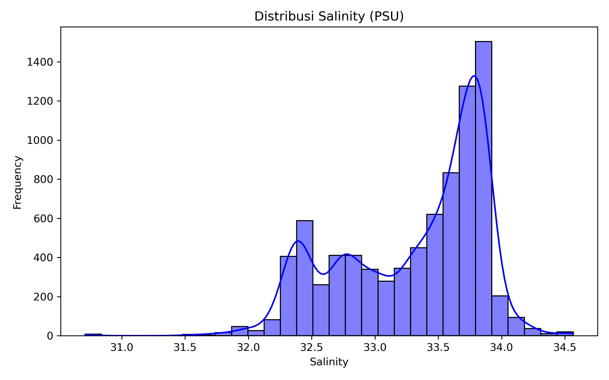
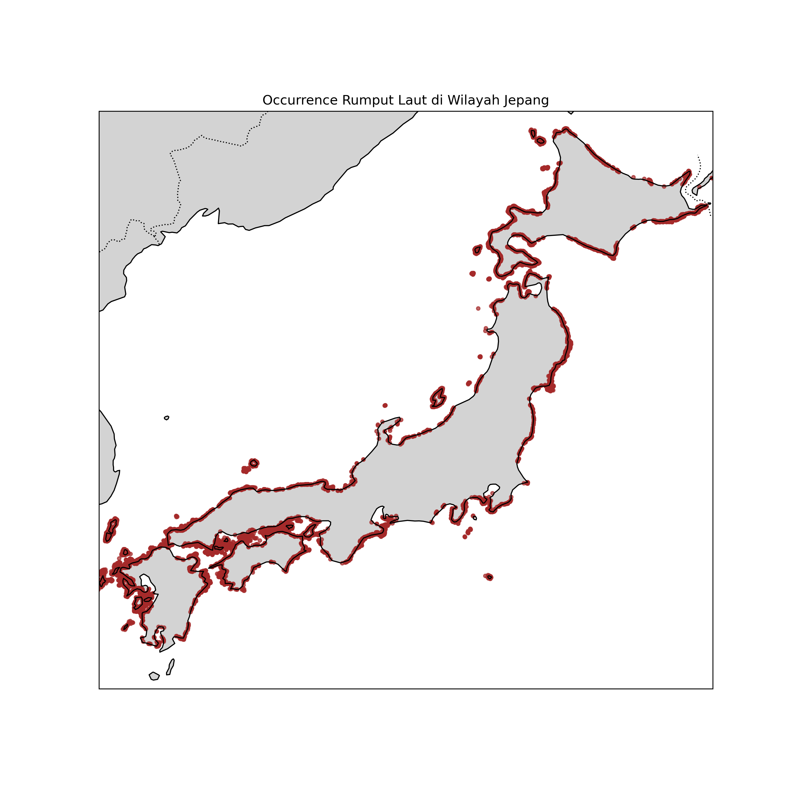
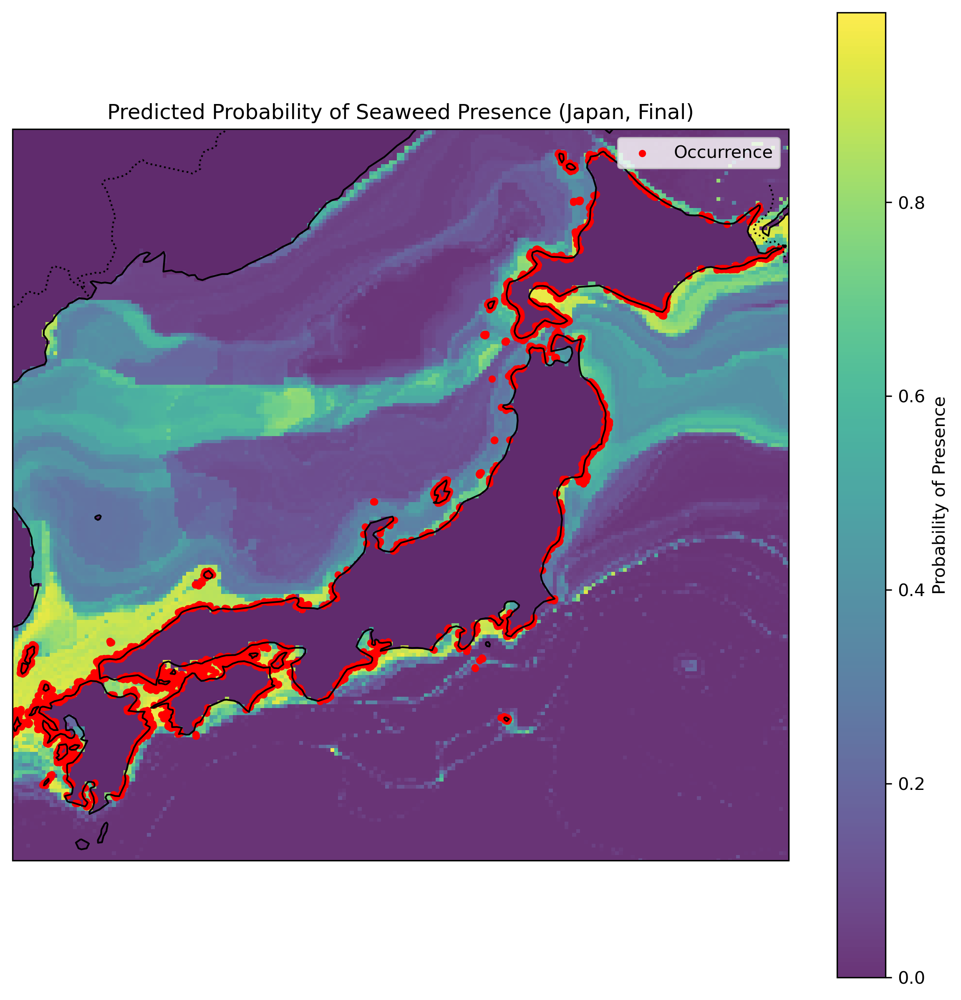

# Species Distribution Model for Seaweed (Japan)

A comprehensive species distribution modeling (SDM) project for seaweed in Japanese waters using Random Forest classification with environmental data from OBIS & Bio-ORACLE.

## 📋 Project Overview

This project builds a predictive model to map the probability of seaweed species occurrence across Japanese coastal waters (30–46°N, 129–146°E) using:
- **Occurrence data**: OBIS database (20 target seaweed species)
- **Environmental variables**: SST (Sea Surface Temperature) and Salinity from Bio-ORACLE v3
- **Modeling approach**: Random Forest classifier with pseudo-absence generation

## 📁 Project Structure

```
Species Distribution Model for Seaweed/
├── notebooks/
│   ├── 01_data_acquisition_&_initial_preprocessing.ipynb
│   ├── 02_exploratory_data_analysis_(EDA)_&_visualisasi.ipynb
│   ├── 03_bio_oracle_environmental_integration.ipynb
│   └── 04_SDM_Modeling_(Random Forest).ipynb
├── data/
│   ├── raw/
│   │   ├── kelp_occurrence_raw.txt
│   │   ├── sst-2010-2020.nc
│   │   └── salinity-2010-2020.nc
│   └── processed/
│       ├── occurrence_with_environment.csv
│       ├── occurrence_cleaned_for_sdm.csv
│       └── sdm_predicted_grid_japan_final.csv
├── figures/
│   ├── eda_species_count.png
│   ├── eda_spatial_occurrence.png
│   ├── feature_importance_rf_final.png
│   └── probability_map_japan_final.png
└── README.md
```

## 🔬 Workflow

### **Notebook 01**: Data Acquisition & Initial Preprocessing
- Download occurrence data from OBIS
- Filter 20 target seaweed species
- Extract SST and Salinity from Bio-ORACLE NetCDF files
- Save processed dataset

### **Notebook 02**: Exploratory Data Analysis (EDA)
- Analyze species distribution across space
- Visualize environmental variable distributions
- Generate spatial maps of occurrence points
- Create scatter plots (SST vs Salinity)

### **Notebook 03**: Data Cleaning & Feature Engineering
- Handle missing values (depth, SST, salinity)
- Create composite depth column (`depth_m`)
- Add presence label for modeling
- Prepare final dataset for SDM

### **Notebook 04**: SDM Modeling & Probability Mapping
- Generate realistic pseudo-absence points
- Train Random Forest classifier (500 estimators)
- Evaluate model (ROC-AUC, classification metrics)
- Predict probability grid across Japan
- Visualize final probability map

## 🎯 Target Species

- *Undaria pinnatifida* (wakame)
- *Saccharina japonica* (kombu)
- *Sargassum* spp. (hondawara)
- *Eisenia bicyclis* (arame)
- *Ecklonia* spp.
- *Gelidium* spp.
- *Ulva pertusa*
- And others (20 total)

## 📊 Model Features

| Feature | Source | Unit |
|---------|--------|------|
| SST | Bio-ORACLE | °C |
| Salinity | Bio-ORACLE | PSU |
| Depth | OBIS (mean of min/max) | m |

## 📈 Expected Outputs

- **Feature importance** ranking (RF model)
- **ROC-AUC score** on test set
- **Probability map** of seaweed presence (200×200 grid)
- **Predicted grid CSV** with lat/lon/probability


## 📝 Notes

- Missing environmental values are handled via median imputation (depth), dropping rows with missing SST/Salinity
- Pseudo-absences are sampled from coastal areas with environmental data clipped to observed ranges
- Model uses stratified train-test split (80/20)

## Datasets Used

- Bio-ORACLE v3.0 | Present-day conditions (decade 2010–2020) | Surface layers | Ocean Temperature (Mean) & Salinity (Mean) 
Link: https://www.bio-oracle.org/downloads-to-email.php

- OBIS | Kelp dataset 
Link: https://obis.org/dataset/2e0f8766-9a75-4422-9ba4-7f65acfbeb51

Raw data files in `data/raw/` (as in repository): `kelp_occurrence_raw.txt`, `sst-2010-2020.nc`, `salinity-2010-2020.nc`.

Processed data and model outputs are in `data/processed/` (e.g., `occurrence_with_environment.csv`, `occurrence_cleaned_for_sdm.csv`, `sdm_predicted_grid_japan_final.csv`).

## Methodology

- Data acquisition from OBIS and Bio-ORACLE
- Preprocessing: coordinate filtering, depth aggregation, cleaning and median imputation for depth
- Feature extraction: sample environmental values at occurrence points, derive `depth_m` and environmental summaries
- Pseudo-absence generation within coastal envelope constrained by observed environmental ranges
- Model training using stratified split, hyperparameter defaults for Random Forest, evaluation on hold-out test set
- Probability prediction across a regular grid and visualization of spatial probability maps

## Machine Learning Model

- **Algorithm**: Random Forest classifier
- **Key settings**: 500 trees (estimators), default max features, class weighting via balanced sampling
- **Input features**: SST, Salinity, Depth (and any engineered composites)
- **Evaluation metrics**: ROC-AUC, accuracy, precision, recall; feature importance from mean decrease in impurity (Gini)

## Limitations

- Occurrence data bias: OBIS sampling is uneven spatially and temporally
- Environmental layers are relatively coarse and may not capture fine-scale coastal heterogeneity
- Pseudo-absence strategy influences model outcomes and can introduce bias
- Model assumes static environment (2010–2020 averages); does not model temporal trends
- Results are probabilistic and should be interpreted alongside ecological expertise


## Figures

Berikut adalah beberapa visualisasi penting yang dihasilkan dari analisis data:

- 
- 
- 
- 
- 

Silakan lihat gambar-gambar ini untuk pemahaman yang lebih baik tentang distribusi spesies dan faktor lingkungan.

## Author

**Henry Kevin**  
Background: Information Systems | Data Science | Machine Learning  
Focus: Environmental Data Analysis & Marine Biodiversity